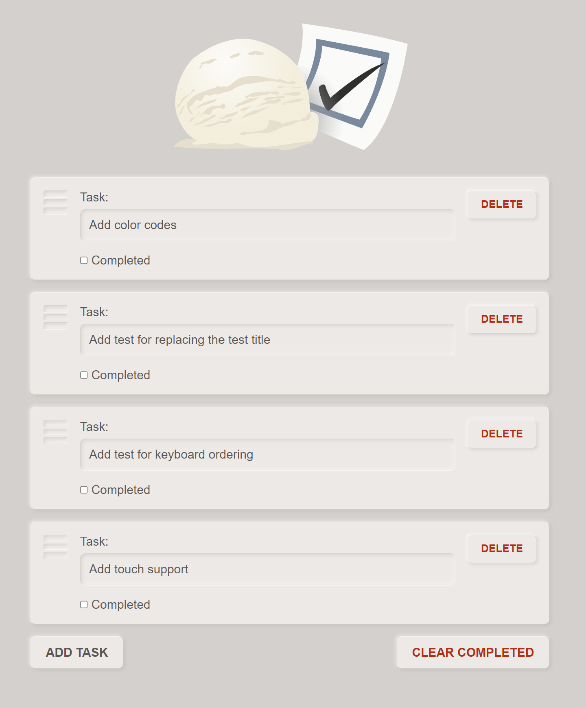

# Yet another TODO app written in plain JavaScript

TODO app is a good basic application that demonstrates a lot of the key 
concepts in web application development. This particular example focuses on 
the use of forms APIs to represent the entire application sate entirely in 
the DOM.

## NOTICE

No frameworks were invented in the making of this app.

## Running the example

The example file, `index.html` can be opened in your browser normally without 
requiring any development server. You can also use the HTML preview feature in 
your IDE or editor if one is available.

## Running tests

Test are executed in the `test.html` file. This file is opened in the 
browser the same way you would open the `index.html` file. Tests results are 
shown in the console. The actual code of the tests is found in the `tests.client.js` 
file. The tests are executed with the help of a custom-made test runner 
found in `vanila-tester.js`.

## Live demo

You will find the live demo at 
[foxbunny.github.io/vanilla-todo](https://foxbunny.github.io/vanilla-todo/). 
The tests can also be run live by opening 
[this page](https://foxbunny.github.io/vanilla-todo/tests.html) (results are
shown in the developer console).

## Screenshot

## Concepts

Here are some of the concepts that this applications demonstrates.

### VP architecture

The VP architecture is a variant of the MVP architecture that uses DOM state 
as application state. This is *not* a universal architecture and does not 
work (well) in all cases. This application was specifically chosen to 
demonstrate the architecture. 

The code is organized into layers. These layers are as follows:

- Global constants
- Utility
- Data (storage)
- View
- Presenter
- Event listeners

The first two layers, "Global constants" and "Utility" are universal and can 
be used by any other layer.

The "Data" and "View" layers **independently** provide building blocks for 
the "Presenter" layer. This means that the view layer is not allowed to 
access the data layer, and vice versa. The relationship between the concepts 
in these two layers are established in the "Presenter" layer. The presenters 
can call each other in addition to calling data and view code. Some 
presenters may be simple aliases to view functions. Rather than invoking 
the view functions directly in event listeners, we create aliases so that we 
can have a better overview of all available presenters (and, by extension, 
all possible user actions).

The "Event listeners" layer is boilerplate that sets the application in 
motion. Therefore, in the context of this app, the architecture is also 
event-driven. The event listener code performs some basic transformations 
and filtering over the events before invoking the presenters. They are not 
allowed to access the lower layers.

### DOM-infused state

State is stored in and represented by the DOM state. We do not store state any
JavaScript variables but as properties/attributes on DOM nodes. This way, we
do not need to perform additional work to synchronize the UI and internal
application sate, as those are on and the same. The DOM becomes the single
source of truth for the application.

### Naming conventions

The JavaScript code associated with the page is named by suffixing 
`.{environment}.js` to the base name of the file. For example, client-side code
for `index.html` is named `index.client.js`. Server-side code (there's 
none in this project) would be named `index.server.js`.

The CSS code associated with the page is named by suffixing 
`.{media target}.css` to the base name of the file. For example, screen 
CSS for `index.html` is named `index.screen.css` suffix, while print CSS would
be named `index.print.css`.

The categories are ordered inside-out (from the core concepts of the UI 
logic towards the higher-level application-level logic). The outer layers 
are built using the inner layers.

This application uses an VP architecture (it's basically an MVP without the 
M). Therefore, it does not have a "Model" category.

The simple rule is that the code from the inner layers cannot use the 
methods from the outer layers.

Global constants are named using all-upper-case snake-case names. For instance,
`AUTO_SAVE_DELAY`. Global constants are used to label magic values (values 
that you come up with by trial and error and are not obvious even in the 
context in which they are used).

Utility methods have simple names that have no specific suffixes or prefixes.
These are general-purpose functions that are not application-specific. If 
you can copy them to another project without modification to the function or 
the target project, they are a utility function.

Data methods have a `data` prefix. For instance, `dataStoreTasks()`. These 
methods use the underlying storage facilities such as the browser storage 
APIs or REST services.

View category has two naming conventions. Objects that represent DOM nodes 
start with the dollar character, `$`. A single `$` character is a special 
case used for anonymous DOM node references (e.g., we don't care what their 
role is, or their role can be easily inferred from the context). The name 
following the `$` character should match the `id` or `class` attribute of 
the element in the HTML. Collections of elements are named using two `$` 
characters (e.g., `let $$items = document.querySelectorAll('.item')`). The 
second convention is that functions that operate on the view are all 
prefixed with `view`.

Presenter methods have a `present` prefix. These are methods that invoke 
functions from the lower layers

### Use of `HTMLFormControlsCollection` interface

Every `<form>` and `<fieldset>` element in the DOM will have an `elements` 
property that implements the 
[`HTMLFormControlsCollection` interface](https://developer.mozilla.org/en-US/docs/Web/API/HTMLFormControlsCollection).
This is used throughout the app to quickly access the named inputs, as opposed 
to using `Element.queryString()` and `Element.queryStringAll()` methods.

### Drag-and-drop ordering

Each fieldset represents a task and can be dragged to change the task order. 
We use the [HTML drag and drop API](https://developer.mozilla.org/en-US/docs/Web/API/HTML_Drag_and_Drop_API) 
for this.

### Use of `innerHTML` for rendering elements

To render the fieldset contents we use the `innerHTML` property. This is 
widely considered an unsafe practice, but it is actually only unsafe in 
cases where user input is directly inserted into the markup. We use an 
`escapeHTML` function to clean the input before inserting into the HTML.

### Touch event fallback

Mobile devices do not support the HTML drag & drop API. We can provide a 
fallback based on touch gestures without feature detection and similar gimmicks.
By calling `Event.preventDefault()` in the `touchstart` event listener, we 
prevent some of the events that are triggered later, including the `dragstart`.
Therefore we are able to disable the standard drag & drop handling as soon as 
user starts using touch events for the purpose. As long as both methods provide
an equivalent (and preferably identical) functionality, the end user is none 
the wiser.

### Non-intrusive testing

This application uses automated UI testing (end-to-end testing) only. It 
does not use unit tests at all. This is because instrumenting the 
*application code* to be testable (i.e. writing it in a way that tests can 
access the code) is relatively expensive. Some unit testing fans say "test 
only the public interfaces". Well, for this application, the UI *is* the 
public interface.

The automated UI tests use a very high-level description of the test to avoid 
hard-coding anything related to the application implementation to avoid having 
to expose anything internal just for the testing purposes.

## License

This code is licensed under the terms of the MIT license. See
[LICENSE.txt](LICENSE.txt) for the boring legal verbiage.
